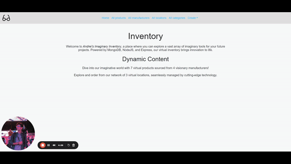

# Inventory Management

This project is an inventory management system built using Node.js, Express, and Bootstrap. It provides functionality to **create, read, update, and delete** entries for products, categories, locations, and manufacturers within an inventory. The project uses a modular structure with separate controllers for each entity and utilizes Bootstrap for a responsive and user-friendly interface.

## Getting Started

To get started with the project, follow these steps:

1. **Clone the repository:**

   ```bash
   git clone https://github.com/your-username/inventory-project.git
   ```
   
2. **Navigate to the project directory:**

    ```bash
    cd inventory-project
    ```

3. **Install dependencies:**

    ```bash
    npm install
    ```
    
4. **Start the project:**

    ```bash
    npm start
    ```

## Project Structure

- **controllers:** Contains controller modules for each entity (category, location, manufacturer, product).
- **routes:** Defines routes for handling various actions related to each entity.
- **views:** Includes templates for rendering views related to each entity, styled with Bootstrap (not included in this example).

## Functionality

### Inventory

- **View Inventory:** Retrieve the main inventory page.

### Category

- **Create Category:** Display the form for creating a new category.
- **Delete Category:** Display the form for deleting a category.
- **Update Category:** Display the form for updating a category.
- **View Category:** Display details of a specific category.
- **List Categories:** Retrieve a list of all categories.

### Location

- **Create Location:** Display the form for creating a new location.
- **Delete Location:** Display the form for deleting a location.
- **Update Location:** Display the form for updating a location.
- **View Location:** Display details of a specific location.
- **List Locations:** Retrieve a list of all locations.

### Manufacturer

- **Create Manufacturer:** Display the form for creating a new manufacturer.
- **Delete Manufacturer:** Display the form for deleting a manufacturer.
- **Update Manufacturer:** Display the form for updating a manufacturer.
- **View Manufacturer:** Display details of a specific manufacturer.
- **List Manufacturers:** Retrieve a list of all manufacturers.

### Product

- **Create Product:** Display the form for creating a new product.
- **Delete Product:** Display the form for deleting a product.
- **Update Product:** Display the form for updating a product.
- **View Product:** Display details of a specific product, including all relevant information.
- **List Products:** Retrieve a list of all products, each with a summary of key details.

## Technologies Used

- **Node.js:** JavaScript runtime for server-side development.
- **Express:** Web application framework for Node.js.
- **MongoDB:** Database for storing inventory data.
- **Bootstrap:** Front-end framework for responsive and visually appealing UI.

Feel free to customize and adapt the project according to your specific needs!
